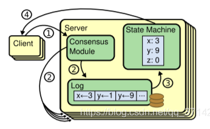
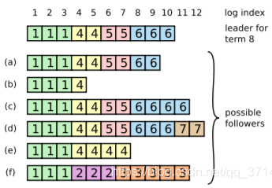

# **raft协议**
## **复制状态机**

复制状态机+一致性协议：解决了分布式系统中的高可用以及容错性，比如Zookeeper，HDFS等。

1. 所谓复制状态机，就是说每一台服务器上维持着一份持久化Log，然后 通过一致性协议算法，保证每一个实例中的Log保持一致，并且顺序存放，这样客户端就可以在每一个实例中读取到相同的数据。

2. 如上图所示，有一个Consensus Module就是一致性协议模块，它可以是Paxos算法的实现或者Raft算法。

重要概念

几个状态以及它的RPC调用，它主要有两个RPC通信，分别是

- RequestVote RPC：负责选举
- AppendEntries RPC：数据的交互。

这里需要着重理解Term，对于每一个leader，都会有一个Term，它会将这个term带到log日志中的entry中，代表当前entry是在哪一个term时期写入。

## **协议的三个阶段**
1. 选主阶段

2. 日志复制阶段

3. 安全状态

由上述图片例子开始描述各个阶段，

当前节点的term（时期）为4，state为leader（为主节点），commitIndex为0，总共有5个实例。

### **选主阶段**
节点故障：主节点和其他子节点之间通过心跳机制保持联系，如果在一段时间内收不到心跳报告，则将该节点判为故障。

1. 如果从节点故障，那么待故障恢复之后，就会去主节点同步日志进行故障恢复。

2. 如果主节点故障，那么会重新进入选举阶段， 

每一个实例会随机sleep一个timeout，timeout结束后，将当前的term加1，然后开始投票，

1. 选举最大的serverid所在的那台机器, 
1. 如果自己接收到的投票小于自己的term，那么投反对票，即选举自己。
1. 如果某台机器有超过半数以上的实例同意，那么将其选举为leader。
1. 如果选举失败，则会将当前term再加1进行选举，直到选举成功。

之所以随机sleep一个time，是因为这样可以加快选举的流程，在一般情况下，只要网络状态良好，先timeout的实例先进行选举，这样只需要一轮选举就选举出leader，避免了由于相互选举而再次进入选举的情况。

### **数据同步阶段**
选举完成之后，

1. 客户端与leader交互写入数据entry，这时leader会在自己的log的第一个空位index中写入。
1. 通过AppendEntries RPC把当前index的entry以及lastest commiteid（不是当前的commitId）发送给每一个follower从节点，
1. 如果follower接收到的lastest commiteid等于当前实例的最新commitId，代表<=该ID的所有entry已经被commit，此时follower返回true，否则返回false,
1. 如果超过半数的follower向leader返回true，那么代表当前entry写入成功。
1. 返回false的实例，可能是因为网络原因或者故障恢复的原因，数据没有正确同步，此时leader会从最后一个entry开始向前遍历，知道找到故障实例对应的entry，然后开始恢复数据。

下图举例说明：

leader的当前index=8，term为3，x=4，开始同步数据，

会收到第一个（包括自己），第三个和第五个实例的同意，大于半数的实例返回true，当前entry commit，

第二个和第四个实例将会返回false，此时leader会从最后一个entry开始从后向前遍历，将当前index发送给返回false的实例，直到它返回true开始同步数据。

比如刚开始leader发送index=8，term=3，x=4的数据给第二个实例，它将会返回false，接着发送前一个entry，也返回false，直到发送index=6，term=3，y=7的数据时返回true，开始正确同步数据，第四个实例也同理。

#### **节点宕机**
数据同步的时候节点发生宕机，如图所示：

对于a~f的实例，可能是因为某种故障而展现出的不同情况，它们都有可能成为leader。

以其中的（f）实例为例解释一下故障发生的原因，从而变成了从节点。

- （f）实例之前可能在term=2时是leader节点，在写入数据的时候，它只写入了自己的log后就发生宕机，
- 在一个短暂的时间之后，它故障恢复，并且有再次被选举为leader，并且当前term=3，此时它写入数据，但是又在写入自己的log日志后但未发送给其他节点的时候发生故障宕机。

所以就造成了上述的现象，对于其他实例的故障也类似。

从上图可以看出，每一个实例都维护这一个最小committed index，代表着小于等于当前index的数据已经全部被commit，那么如果在收到leader的提交的index的时候会进行比较，此时会出现一个有意思的问题呢，之前提交的log日志可能被修改，或者更准确的说被覆盖。比如说(f)的term为1后面的term.

