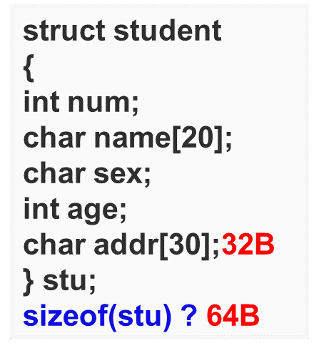
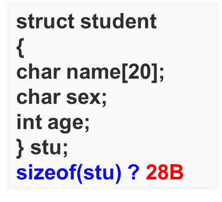

# 结构体变量的空间分配

**结构体按最大类型增量分配空间，且从上往下在内存中按顺序分配**

* **最大类型**：结构体内的成员中最大宽度（占用内存）的变量类型
* **增量**：所占字节大小

## 1. 例1


以上例来说，最大类型为int，增量为4B（字节）
那么，从成员依次从上往下看来，首先：
```
int num;            4B
char name[20];      20B
char sex;           4B
int age;            4B
char addr[30];      32B
```
加起来就是64B。

## 2. 例2

再举一个特殊的例子
```
struct stu{
	char a;
	int b;
	char c;
};
```
上例，
```
char a;	4B
int b;	4B
char c;	4B
```
也就是12B

## 3. 例2变体

如果是这样：
```
struct stu{
	char a;
	char c;
	int b;
};
```
首先给a分配4B，接下来是c，由于跟上一个分配的变量是同一类型，先看上一个分配的还有没有剩余空间，若有，就不用再给c分配，没有再重新按最大类型增量分配；
在这里，c的上一个，即char a;分了4B，还剩下3B，可以容纳c，就不再为c重新分配；
即char a 与char c共用4B，接下来是int b;再分配4B，整个结构体的内存分配就为8B。

## 4. 例3



char name[20];刚好20个字节，可以用5个int（4B）的大小分配完，这里就由于sex上一个同类型的已分配空间容量不足，只能再开辟新的4B，再加上int age;分配的4B因此整个结构体的内存分配为28B.