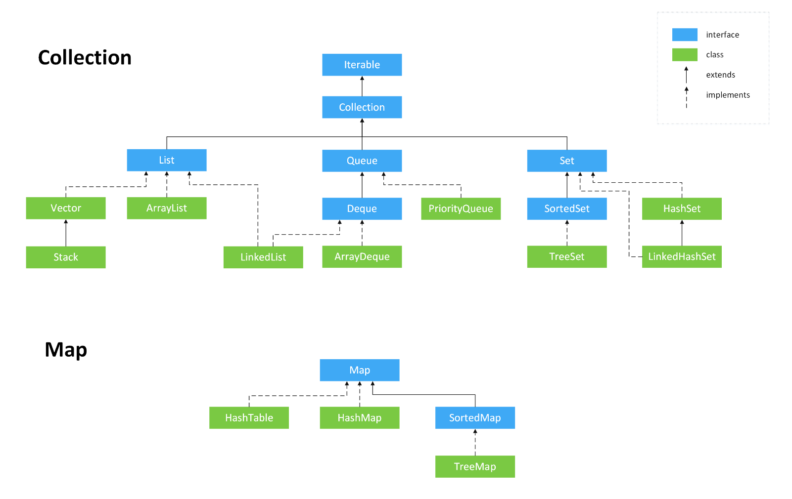
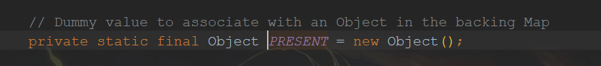

# 总览

* HashSet(无序，唯一): 基于 HashMap 实现。其value为常量值new Object();
* LinkedHashSet: 基于LinkedHashMap 实现。其value为常量值new Object();
* LinkedHashMap 继承自 HashMap，所以它的底层仍然是基于拉链式散列结构即由数组和链表或红黑树组成。另外，LinkedHashMap 在上面结构的基础上，增加了一条双向链表，使得上面的结构可以保持键值对的插入顺序。同时通过对链表进行相应的操作，实现了**访问顺序**相关逻辑。详细可以查看：[《LinkedHashMap 源码详细分析（JDK1.8）》](https://www.imooc.com/article/22931)

* TreeSet(有序，唯一): 红黑树(自平衡的排序二叉树)
* PriorityQueue: Object[] 数组来实现二叉堆
* ArrayQueue: Object[] 数组 + 双指针

