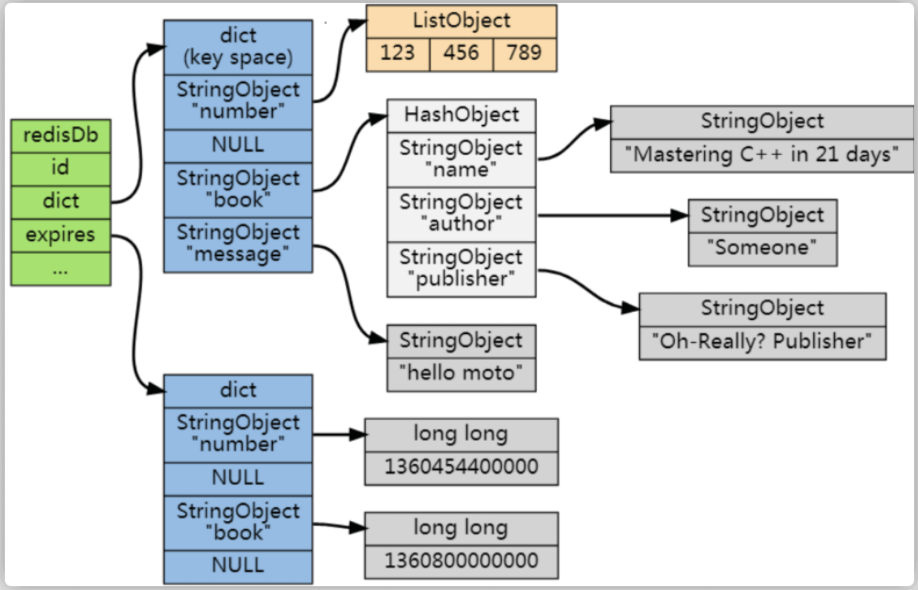

# 缓存过期

## 判断数据过期

redisDb 这个结构体存储着过期字典：

```
typedef struct redisDb {
    ...

    dict *dict;     //数据库键空间,保存着数据库中所有键值对
    dict *expires   // 过期字典,保存着键的过期时间
    ...
} redisDb;
```

过期字典（可以看作是 hash 表）保存数据过期的时间。

* 过期字典的key指向 Redis 数据库中的某个 key(键)，
* 过期字典的value是一个 long long 类型的整数，这个整数保存了 key 所指向的数据库键的过期时间（毫秒精度的 UNIX 时间戳）。



## 过期数据的删除策略

常用的过期数据的删除策略就两个：

* 懒汉删除 ：只会在取出 key 的时候才对数据进行过期检查。这样对 CPU 最友好，但是可能会造成太多过期 key 没有被删除。
* 定期删除 ： 每隔一段时间抽取一批 key 执行删除过期 key 操作。并且，Redis 底层会通过限制删除操作执行的时长和频率来减少删除操作对 CPU 时间的影响。


定期删除对内存更加友好，惰性删除对 CPU 更加友好。两者各有千秋，所以 Redis 采用的是 定期删除+懒汉式删除 。

不过，懒汉对没使用到的不会检查，而这部分没被检查到的又没被定期抽到，那么这一部分本该过期的却长期滞留内存造成了**内存泄露**，继而oom，因此仅仅设置过期时间是不够的。

### Redis 内存淘汰机制

Redis 提供 6 种数据淘汰策略：

1. volatile-lru（least recently used）：从已设置过期时间的数据集（server.db[i].expires）中挑选最近最少使用的数据淘汰
2. volatile-ttl：从已设置过期时间的数据集（server.db[i].expires）中挑选将要过期的数据淘汰
3. volatile-random：从已设置过期时间的数据集（server.db[i].expires）中任意选择数据淘汰
4. allkeys-lru（least recently used）：当内存不足以容纳新写入数据时，在键空间中，移除最近最少使用的 key（这个是**最常用**的）
5. allkeys-random：从数据集（server.db[i].dict）中任意选择数据淘汰
6. no-eviction：禁止驱逐数据，也就是说当内存不足以容纳新写入数据时，新写入操作会报错。这个应该没人使用吧！


4.0 版本后增加以下两种：

7. volatile-lfu（least frequently used）：从已设置过期时间的数据集（server.db[i].expires）中挑选最不经常使用的数据淘汰
8. allkeys-lfu（least frequently used）：当内存不足以容纳新写入数据时，在键空间中，移除最不经常使用的 key