# **内部排序**
动态演示算法<https://www.cs.usfca.edu/~galles/visualization/Algorithms.html>

排序的稳定性：排序后，相同数据的相对顺序保持不变，即该算法稳定。
## **拓扑排序**
后序遍历的逆序即拓扑排序的结果.

找到做事的先后顺序（可以应用在找“关键路径”中）

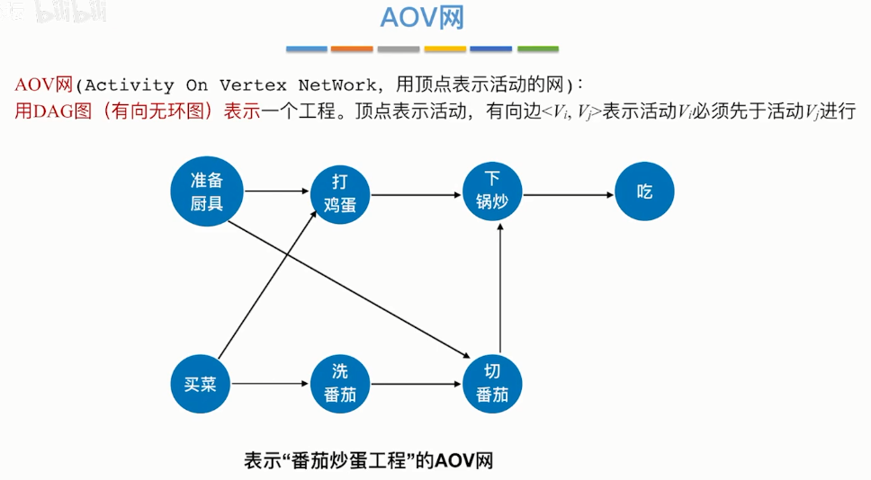


邻接表实现，时间复杂度低，逆拓扑排序（找出度为0）用邻接矩阵或逆邻接表，也可以用dfs实现

## **插入排序**

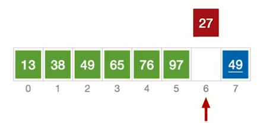

## **希尔排序**
对插入排序的优化


定义：


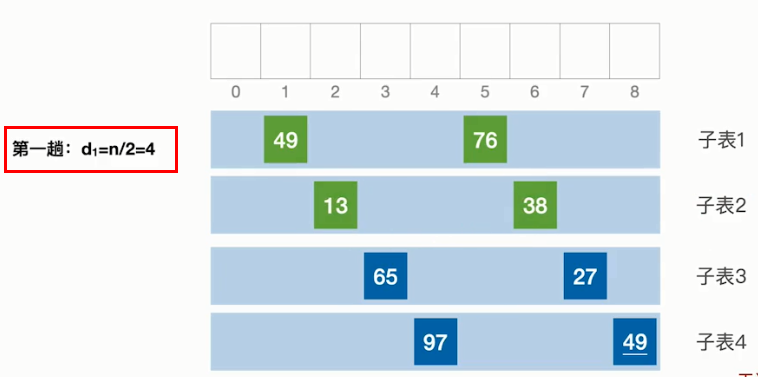

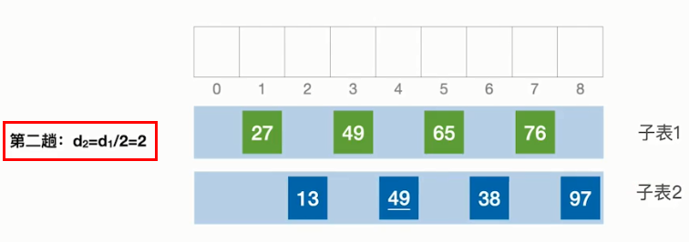

## **冒泡排序**


冒泡排序定义：


## **快速排序**

>先序遍历

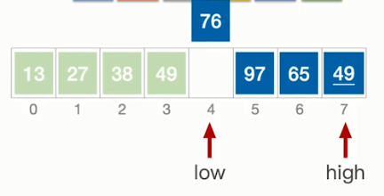

选择基准元素，

low指针：比基准元素小

high指针：比基准元素大

两个指针若谁的指向为空，则让另一个指针指向的元素和基准元素比较大小，

- 若不满足条件，将该指针指向的元素赋值到指向为空的指针；
- 若满足条件，则移动指向不为空的指针（low向后移，high向前移）。

```
public void fastSort(int[] nums, int begin, int end){
    if(begin >= end) return ;
    int index = process(nums,begin,end);
    fastSort(nums,begin,index-1);
    fastSort(nums,index+1, end);
}
public int process(int[] nums, int begin, int end){
    int base = nums[end];
    while(begin < end){
        while(nums[begin] >= base && begin < end){
            begin++;
        }
        nums[end] = nums[begin];
        while(base >= nums[end] && begin < end){
            end--;
        }
        nums[begin] = nums[end];
    }
    nums[end] = base;
    return end;
}
```

## **简单选择排序**


简单选择排序定义：


## **堆排序**
大根堆递增，小根堆递减。


要使用堆排序，

1.首先必须将原始数组排成大根堆（小根堆）。

2.处理非终端结点：顺序存储的（数组）完全二叉树，其中非终端结点为i≤n/2的结点。令其满足大根堆（小根堆）的要求。

\3. 堆排序：每一趟将堆顶元素加入有序子序列，每一趟之后，整理剩下的二叉树（不算有序子序列）为大根堆（小根堆）。【重复3】

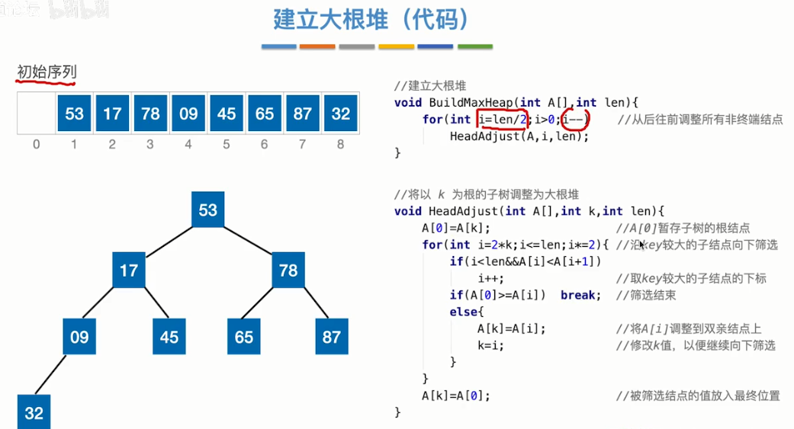


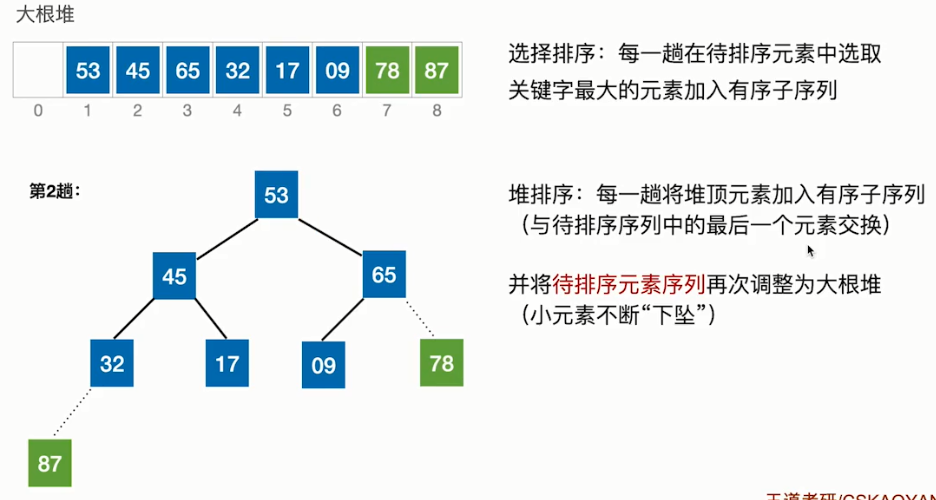

```
public class HelloWorld {  
    public static void main(String []args) {  
       int[] array = new int[]{4, 5, 8, 2};  
	int k = 3;  
	for(int i = array.length / 2 - 1; i >= 0; i--){  
	    adjustBigHeap(array, i, array.length);  
	}  
	  
	for(int i = 0; i<4;i++){  
	    System.out.println(array[i]);  
	}  
	  
    }  
      
    //调整为大根堆，左子结点为2i+1,右子结点为2i+2  
    public static void adjustBigHeap(int[] array, int i, int len){  
	int tmp = array[i];  
	for(int j = 2*i+1; j < len; j = 2*j+1){  
	    if(j<len-1 && array[j] < array[j+1]) j++;  
	    if(tmp < array[j]){  
		array[i] = array[j];  
		i = j;  
	    }else break;  
	}  
	array[i] = tmp;  
    }  
}  
```

## **归并排序**

>后序遍历

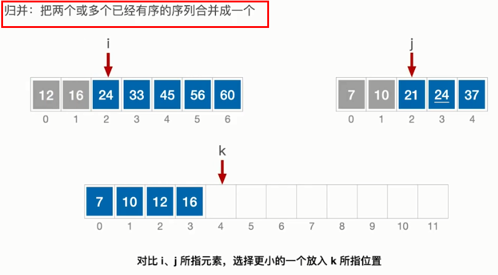

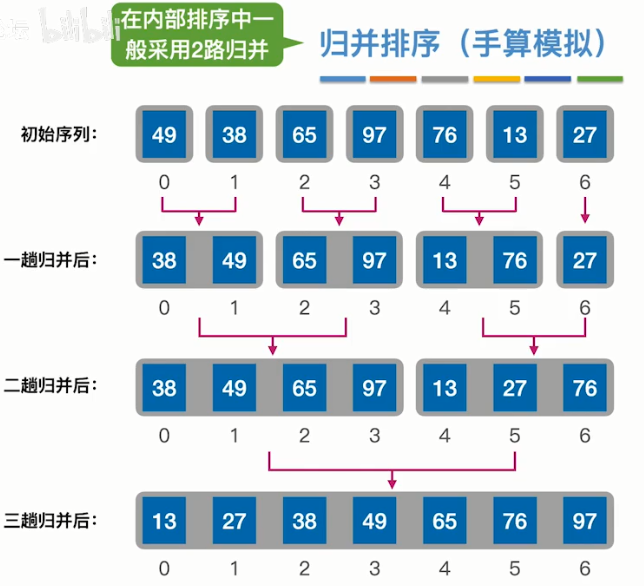

```
public ListNode sortInList (ListNode head) {
    // write code here
    if(head == null || head.next == null)
                return head;
    //使用快慢指针找到中点
    ListNode slow = head, fast = head.next;
    while(fast!=null && fast.next !=null){
        slow = slow.next;
        fast = fast.next.next;
    }
    //分割为两个链表
    ListNode newList = slow.next;
    slow.next = null;
    //将两个链表继续分割
    ListNode left = sortInList(head);
    ListNode right = sortInList(newList);
    ListNode lhead = new ListNode(-1);
    ListNode res = lhead;
    //归并排序
    while(left != null && right != null){
        if(left.val < right.val){
            lhead.next = left;
            left = left.next;
        } else{
            lhead.next = right;
            right = right.next;
        }
        lhead = lhead.next;
    }
    //判断左右链表是否为空
    lhead.next = left!=null?left:right;
    return res.next;
}
```

## **基数排序**


递减

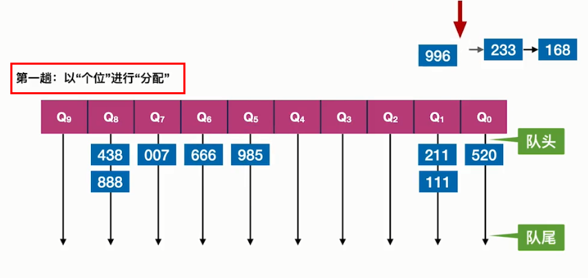


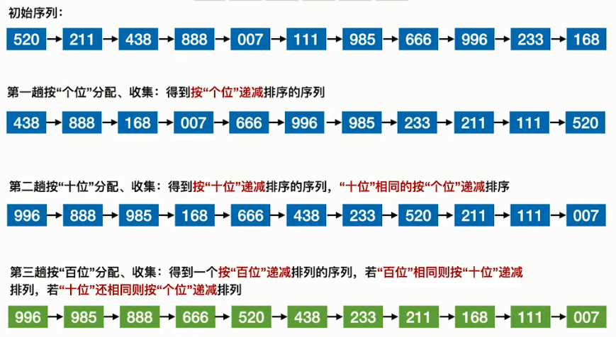


