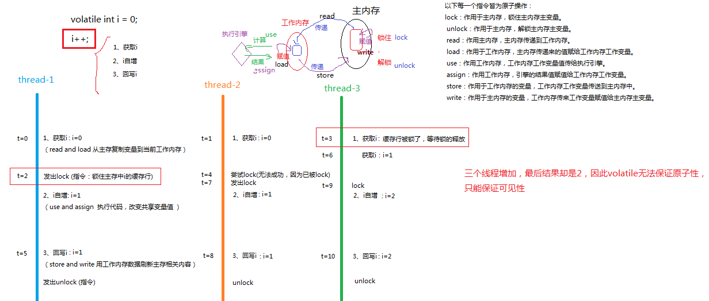

# volatile

建议先看：[cpu缓存模型](../../chapter15/section1/index.md)

## java内存模型（JMM）

在 JDK1.2 之前，Java 的内存模型实现总是从主存（即共享内存）读取变量，是不需要进行特别的注意的。

而在当前的 Java 内存模型下，线程可以把变量保存本地内存（native memory,比如机器的寄存器）中，而不是直接在主存中进行读写。这就可能造成一个线程在主存中修改了一个变量的值，而另外一个线程还继续使用它在寄存器中的变量值的拷贝，造成数据的不一致。

为了解决这个问题，就需要把变量**声明为 volatile**，这就指示 JVM，这个变量是共享且不稳定的，每次使用它都到主存中进行读取。

**总结**

多线程下，
* 普通变量的读取若是寄存器已有副本（之前已经从主存中读取到寄存器过），则其它线程则直接读取寄存器里的值。
* 但如果是volatile修饰过的，该变量会强制从主存进行读取。

## lock指令

https://www.cnblogs.com/yaowen/p/11240540.html

volatile关键字使用的是Lock指令，volatile的作用取决于Lock指令。

**工作内存**：指代寄存器之类的存储器。

>在写(use)之前会锁住主内存中的缓存行，让其它volatile的变量无法use。

**可见性：**

起到内存屏障的作用，保证了**有序性**(防止指令重排)。

java内存屏障可以被分为以下几种类型：
1. LoadLoad屏障：对于这样的语句Load1; LoadLoad; Load2，在Load2及后续读取操作要读取的数据被访问前，保证Load1要读取的数据被读取完毕。
2. StoreStore屏障：对于这样的语句Store1; StoreStore; Store2，在Store2及后续写入操作执行前，保证Store1的写入操作对其它处理器可见。
3. LoadStore屏障：对于这样的语句Load1; LoadStore; Store2，在Store2及后续写入操作被刷出前，保证Load1要读取的数据被读取完毕。
4. StoreLoad屏障：对于这样的语句Store1; StoreLoad; Load2，在Load2及后续所有读取操作执行前，保证Store1的写入对所有处理器可见。**它的开销是四种屏障中最大的**。

在大多数处理器的实现中，**StoreLoad屏障**是个万能屏障，兼具其它三种内存屏障的功能。

