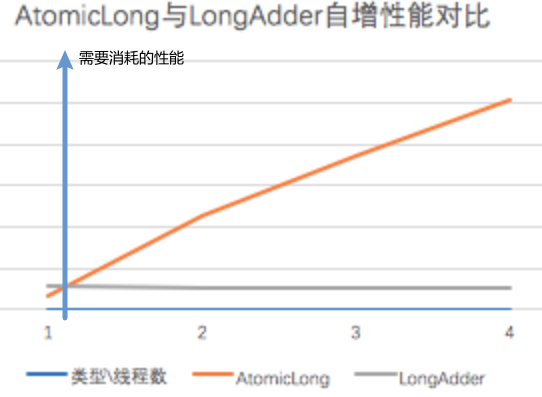

# 原子类

https://www.cnblogs.com/9dragon/archive/2019/12/11/12023971.html

## 1. [CAS](../section11/index.md)

约定：

* compareAndSet: java代码，内部获得旧值和实参传入的期待值进行比较，相同调用本地方法compareAndSwap;
* compareAndSwap: native代码，操作系统已经实现了cas指令（引用,期待值,新值），底层进行比较和赋值的二合一的原子性操作。

>众所周知，cpu为分时复用的，而一个指令只能在一个时间片里执行完成，因此指令是原子性的。

## 2. Unsafe类

https://www.cnblogs.com/pkufork/p/java_unsafe.html

所有的Atomic****中的compareAndSet内部最终都要调用Unsafe的compareAndSwap，去底层真正地调用cas指令，从而实现了业务层的“免锁”操作。

它里面封装了一些对底层资源的访问，包括直接访问内存、使用cas指令等，但是这个类只允许jdk访问，其他地方使用Unsafe会报错。

要想使用Unsafe类需要用一些比较tricky的办法。Unsafe类使用了单例模式，需要通过一个静态方法getUnsafe()来获取。但Unsafe类做了限制，如果是普通的调用的话，它会抛出一个SecurityException异常；只有由主类加载器加载的类才能调用这个方法。

有一些办法来用主类加载器加载用户代码，比如设置bootclasspath参数。

但更简单方法是利用Java反射，方法如下：
```
Field f = Unsafe.class.getDeclaredField("theUnsafe");
f.setAccessible(true);
Unsafe unsafe = (Unsafe) f.get(null);
```

如果使用unsafe开辟的内存，是不被JVM垃圾回收管理，需要自己管理，容易造成内存泄漏等。

### 2.1 提供的功能：

* 内存管理：包括分配内存、释放内存等。
* 非常规的对象实例化。
* 操作类、对象、变量。
* 数组操作。
* 多线程同步。包括锁机制、CAS操作等。
* 挂起与恢复。这部分包括了park、unpark等方法。
* 内存屏障。包括了loadFence、storeFence、fullFence。

## 3. 原子包装类

以AtomicLong为例，其它Atomic的包装类实现一样。

### 3.1 AtomicLong

>**存在ABA问题**

AtomicLong的几个重要成员变量：
```
private static final Unsafe unsafe = Unsafe.getUnsafe();
 
private volatile long value;
 
private static final long valueOffset;
```

AtomicLong是如何利用CAS实现免锁线程安全的：
```
//AtomicLong类
// AtomicLong一个利用CAS更新值的方法：将Atomic的值更新成newValue，返回老的值
public final long getAndSet(long newValue) {
        // 这里调用的是Unsafe的CAS方法
        return unsafe.getAndSetLong(this, valueOffset, newValue);
}
//Unsafe类
public final long getAndSetLong(Object obj, long valueOffset, long newValue) {
    long oldValue;
    do {
        //通过对象及偏移量获得属性的值。getLongVolatile()是个native防范
        oldValue = this.getLongVolatile(obj, valueOffset);
        
        // cas来更新值。compareAndSwapLong()方法是个native方法，封装的就是cAS指令
    } while(!this.compareAndSwapLong(obj, valueOffset, oldValue, newValue));// cas不成功就在无限重试

    return oldValue;
}
```

可以看见如果Unsafe.getAndSetLong中的CAS失败，会无限重试，直到成功为止。极端一点并发特别高，每次CAS失败，那么一个线程就会一致再这疯狂的重试，然后更多的线程进来重试，那么cpu会被瞬间打爆的。

所以说，AtomicLong这种类型，只是适合并发冲突不高的场景。
>如果我们要原子更新多个值，可以使用AtomicReference。


### 3.2 LongAdder

https://blog.csdn.net/sinat_14913533/article/details/115588023
https://blog.csdn.net/weixin_43314519/article/details/110195621

>**存在ABA问题**

在AtomicLong的实现中，如果CAS失败，就无限的重试，直到成功为止，但是在LongAdder是想办法尽量减少冲突。

产生冲突的本质原因是多个线程共享一个变量的场景，为了保证对这个变量操作的线程安全，那就必须采取措施，不让多个线程同时操作这个共享变量。一种方式是加锁，这里不多说了。另一种方式就如AtomicLong(cas):

* AtomicLong的思路: 如果一个线程尝试去操作的时候发现有其他线程正在操作，那我就放弃本次操作，过会再来；
* LongAdder的思路: 将这个共享变量打散，变成很多碎片，当遇到多个线程同时更改这个变量的时候，给每个线程分配一个碎片，各自更改一个碎片，然后在读取这个变量的时候，将所有的碎片整合到一起，对外部看来，这就是一个变量。

将一个变量分成了n多部分：一个base和m个cell(m+1=n)，其中base和cell背后其实都是一个long型的变量。

当更新LongAdder数据的时候，首先尝试用CAS去更新base，如果没有冲突就会更新成功，就结束了；如果有冲突，就随机选择一个cell，然后用CAS将数据更新到这个cell上；如果也冲突，那就重新换个cell重试；如果还冲突就将cell的个数扩充2倍，然后再重新选一个cell来cas将数据更新到这个cell上。

读取真正的值时，全部累加起来:

```
public long sum() {
    Cell[] as = cells; Cell a;
    long sum = base;
    if (as != null) {
        for (int i = 0; i < as.length; ++i) {
            if ((a = as[i]) != null)
                sum += a.value;
        }
    }
    return sum;
}
```

#### 问题

* 结果累加造成一定延迟；
* 冲突存在扩容或重试造成一定延迟。

#### 选择

**性能**



**提供的方法**

* LongAdder 只提供了 add、increment 等简单的方法，适合的是统计求和计数的场景，场景比较单一，
* AtomicLong 还具有 compareAndSet 等高级方法，可以应对除了加减之外的更复杂的需要 CAS 的场景。

## 4. 原子引用

### 4.1 原子引用类

>**存在ABA问题**

`java.util.concurrent.atomic.AtomicReference`

原子引用其实和原子包装类(AtomicInteger/AtomicLong)是差不多的概念，就是将一个java类，用原子引用类进行包装起来，那么这个类就具备了原子性。

```
public class ABADemo {

    /**
     * 普通的原子引用包装类
     */
    static AtomicReference<Integer> atomicReference = new AtomicReference<>(100);

    public static void main(String[] args) {

        new Thread(() -> {
            // 把100 改成 101 然后在改成100，也就是ABA
            atomicReference.compareAndSet(100, 101);
            atomicReference.compareAndSet(101, 100);
        }, "t1").start();

        new Thread(() -> {
            try {
                // 睡眠一秒，保证t1线程，完成了ABA操作
                TimeUnit.SECONDS.sleep(1);
            } catch (InterruptedException e) {
                e.printStackTrace();
            }
            // 把100 改成 101 然后在改成100，也就是ABA
            System.out.println(atomicReference.compareAndSet(100, 2019) + "\t" + atomicReference.get());

        }, "t2").start();
    }
}
```

>例子中，原子引用的泛型可以使用任意java类，如自定义一个User类，可以通过原子引用保证对User更改的原子性（不是内部的setter方法，就只是User，就比如说原来原子引用中存的是User类的a实例，可以原子操作替换成User类的b实例）。


### 4.2 原子时间戳引用类

https://blog.csdn.net/weixin_42073629/article/details/104872490

`java.util.concurrent.atomic.AtomicStampedReference`

利用每次更改后添加的时间戳**解决了ABA问题**。

```
public class ABADemo {

    // 传递两个值，一个是初始值，一个是初始版本号
    static AtomicStampedReference<Integer> atomicStampedReference = new AtomicStampedReference<>(100, 1);

    public static void main(String[] args) {

        new Thread(() -> {

            // 获取版本号
            int stamp = atomicStampedReference.getStamp();
            System.out.println(Thread.currentThread().getName() + "\t 第一次版本号" + stamp);

            // 暂停t3一秒钟
            try {
                TimeUnit.SECONDS.sleep(1);
            } catch (InterruptedException e) {
                e.printStackTrace();
            }

            // 传入4个值，期望值，更新值，期望版本号，更新版本号
            atomicStampedReference.compareAndSet(100, 101, atomicStampedReference.getStamp(), atomicStampedReference.getStamp()+1);

            System.out.println(Thread.currentThread().getName() + "\t 第二次版本号" + atomicStampedReference.getStamp());

            atomicStampedReference.compareAndSet(101, 100, atomicStampedReference.getStamp(), atomicStampedReference.getStamp()+1);

            System.out.println(Thread.currentThread().getName() + "\t 第三次版本号" + atomicStampedReference.getStamp());

        }, "t3").start();

        new Thread(() -> {

            // 获取版本号
            int stamp = atomicStampedReference.getStamp();
            System.out.println(Thread.currentThread().getName() + "\t 第一次版本号" + stamp);

            // 暂停t4 3秒钟，保证t3线程也进行一次ABA问题
            try {
                TimeUnit.SECONDS.sleep(3);
            } catch (InterruptedException e) {
                e.printStackTrace();
            }

            boolean result = atomicStampedReference.compareAndSet(100, 2019, stamp, stamp+1);

            System.out.println(Thread.currentThread().getName() + "\t 修改成功否：" + result + "\t 当前最新实际版本号：" + atomicStampedReference.getStamp());

            System.out.println(Thread.currentThread().getName() + "\t 当前实际最新值" + atomicStampedReference.getReference());


        }, "t4").start();
    }
}
```

