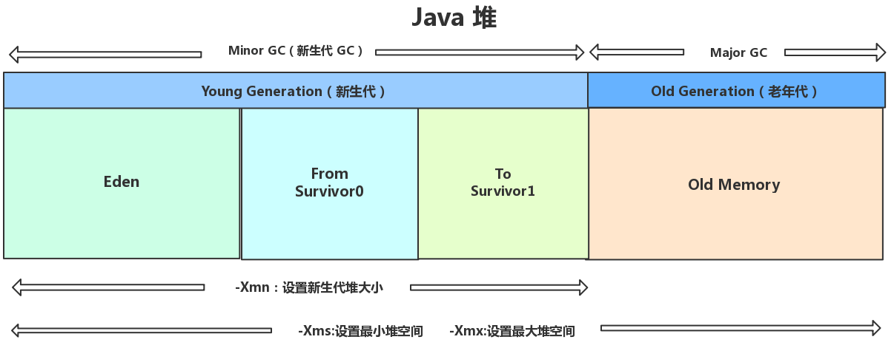
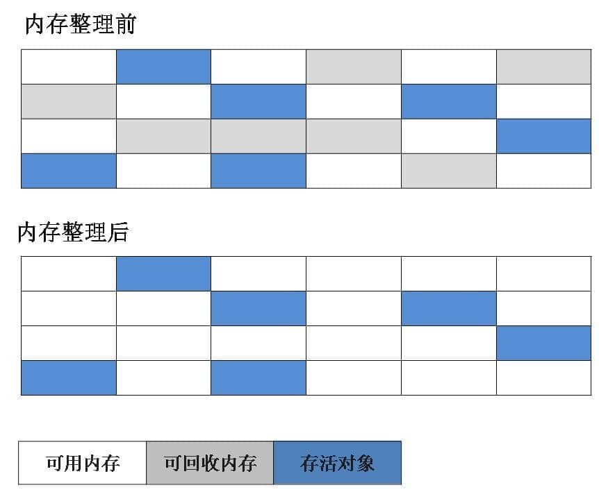
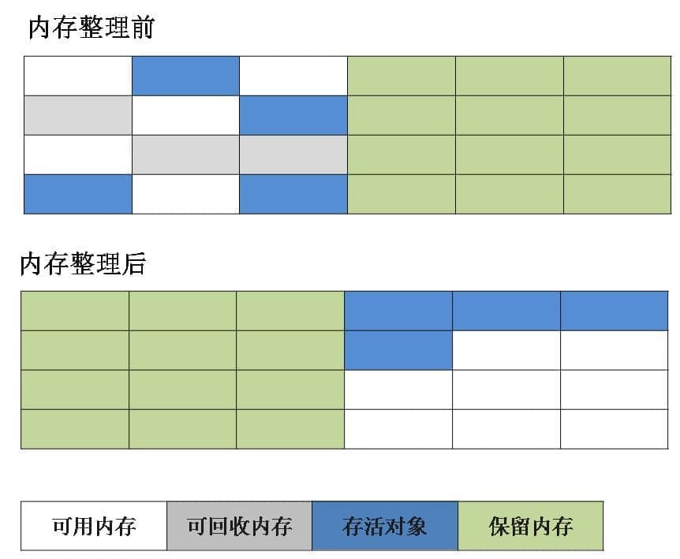
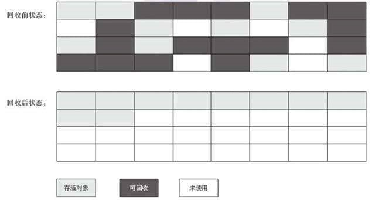

# **jvm垃圾回收**
从垃圾回收的角度，由于现在收集器基本都采用**分代收集**算法，因此堆被分为：新生代和老年代。

## **分配对象时触发gc**
1. 一般对象在eden区分配
1. 而大对象直接进入老年代（为了避免为大对象分配内存时由于分配担保机制带来的复制而降低效率）

>大对象就是需要大量连续内存空间的对象（比如：字符串、数组）

### **minor gc和major gc**
**minor gc**：

发生在新生代的GC。

发生时机：

如果新生的对象无法在 Eden 区创建（Eden 区无法容纳) 就会触发一次Young GC（minor gc别名）。

将 from 区与Eden 区的对象一起进行可达性分析，找出活跃的对象，将它复制到 to 区并且将eden区域和 from 区的对象给清空，这样那些不可达的对象进行清除，并且将from 区 和 to区交换(保证逻辑的to区为空)。

**major gc**：

发生在老年代的GC。

发生时机：

1. 对于一个对象，我们会首先在Eden 尝试创建，如果创建不了，就会触发Minor GC
1. 随后继续尝试在Eden区存放，发现仍然放不下
1. 尝试直接进入老年代，老年代也放不下
1. 触发 Major GC 清理老年代的空间
1. 放的下 成功
1. 放不下 OOM

通过上面的步骤，发现如果发生了major gc，那么之前必然也发生了minor gc。

而full gc指的是清理包括新生代、老年代、永久代（如果存在）的空间。

如果major gc发生了的话，表示清理了老年代，再加上之前发生的minor gc清理的新生代，而java8之后堆不再存在永久代，因此可以说，**major gc通常和full gc等价**。

### **总结**
针对 HotSpot VM 的实现，它里面的 GC 其实准确分类只有两大种： 

- 部分收集 (Partial GC)： 
   1. 新生代收集（Minor GC / Young GC）：只对新生代进行垃圾收集； 
   1. 老年代收集（Major GC / Old GC）：只对老年代进行垃圾收集。需要注意的是 Major GC 在有的语境中也用于指代整堆收集； 
   1. 混合收集（Mixed GC）：对整个新生代和部分老年代进行垃圾收集。 
- 整堆收集 (Full GC)：收集整个 Java 堆和方法区。

## **gc时判断哪些对象需要清理**
死亡的对象需要清理，有两种方法判断对象是否死亡。

### **引用计数法**
给对象中添加一个引用计数器，每当有一个地方引用它，计数器就加 1；当引用失效，计数器就减 1；任何时候计数器为 0 的对象就是不可能再被使用的。（无法解决**相互循环引用**）
### **可达性分析法**
通过一系列的称为 “GC Roots” 的对象作为起点，从这些节点开始向下搜索，节点所走过的路径称为引用链，当一个对象到 GC Roots 没有任何引用链相连的话，则证明此对象是不可用的。

可作为 GC Roots 的对象包括下面几种: 

1. 虚拟机栈(栈帧中的本地变量表)中引用的对象(**局部变量**) 
1. 本地方法栈(Native 方法)中引用的对象 
1. 方法区中类静态属性引用的对象(**static**) 
1. 方法区中常量引用的对象(**final**)
1. 所有被同步锁持有的对象（**锁对象**）

### **强、软、弱、虚引用**
* 强引用：日常使用的普通引用，不会被回收，如果gc后仍空间不够，宁愿抛出oom.

* 软引用：空间够，不回收；空间不够，回收。

* 弱引用：只要gc就回收。

* 虚引用：随时都有可能被回收，主要用来跟踪对象被垃圾回收的活动。

软、弱、虚引用都可以配合一个引用队列一起使用，如果引用的对象被垃圾回收，Java 虚拟机就会把这个引用加入到与之关联的引用队列中。

**软引用的作用**：

可以加速 JVM 对垃圾内存的回收速度，可以维护系统的运行安全，防止内存溢出（OutOfMemory）等问题的产生。

**虚引用的作用**：

当垃圾回收器准备回收一个对象时(无Gcroots引用链)，如果发现它还有虚引用，就会在回收对象的内存之前，把这个虚引用加入到与之关联的引用队列中。程序可以通过判断引用队列中是否已经加入了虚引用，来了解被引用的对象是否将要被垃圾回收。程序如果发现某个虚引用已经被加入到引用队列，那么就可以在所引用的对象的内存被回收之前采取必要的行动。
### **真正gc对象的时机**
1. 对象不可达后，第1次标记；
1. finalize还没有执行过，需要执行（对象覆盖了finalize方法或者没被虚拟机执行过默认的finalize方法，后者有可能无法被执行，直接将对象进行回收【finalize最多被虚拟机执行一次】），第2次标记，

**两次标记后gc**。GC在回收对象之前调用finalize，执行finalize方法完毕后，GC会再次判断该对象是否可达，若不可达，则进行回收，否则，对象“复活”。

如上面虚引用说过的，如果发现了某个对象即将被回收（无论是第1次标记还是第2次），反正虚引加入了相关联的引用队列，那么可以通过找到这个虚引用指向的对象的类，重写其finalize，让这个对象与引用链上的任何一个对象建立关联，那么当虚拟机执行finalize的时候，该对象复活了。

## **清理常量和类**
**废弃常量**

假如在字符串常量池中存在字符串 "abc"，如果当前没有任何 String 对象引用该字符串常量的话，就说明常量 "abc" 就是废弃常量，如果这时发生内存回收的话而且有必要的话，"abc" 就会被系统清理出常量池了。

**无用的类**

同时满足以下3个条件，就**可以**被回收了，但不一定。

1. 该类所有的实例都已经被回收，也就是 Java 堆中不存在该类的任何实例。 
1. 加载该类的 ClassLoader 已经被回收。 
1. 该类对应的 java.lang.Class 对象没有在任何地方被引用，无法在任何地方通过反射访问该类的方法。

## **gc算法**
### **标记清除**

### **标记复制**

### **标记整理**
先标记清除，然后让所有存活的对象向一端移动（如下图左上方向），然后直接清理掉端边界以外的内存。

### **分代收集（young复制old清除或整理）**
新生代中，每次收集都会有大量对象死去，所以可以选择”标记-复制“算法，只需要付出少量对象的复制成本就可以完成每次垃圾收集。

老年代的对象存活几率是比较高的，而且没有额外的空间对它进行分配担保，所以我们必须选择“标记-清除”或“标记-整理”算法进行垃圾收集。

## **gc收集器**
gc算法的具体实现。

