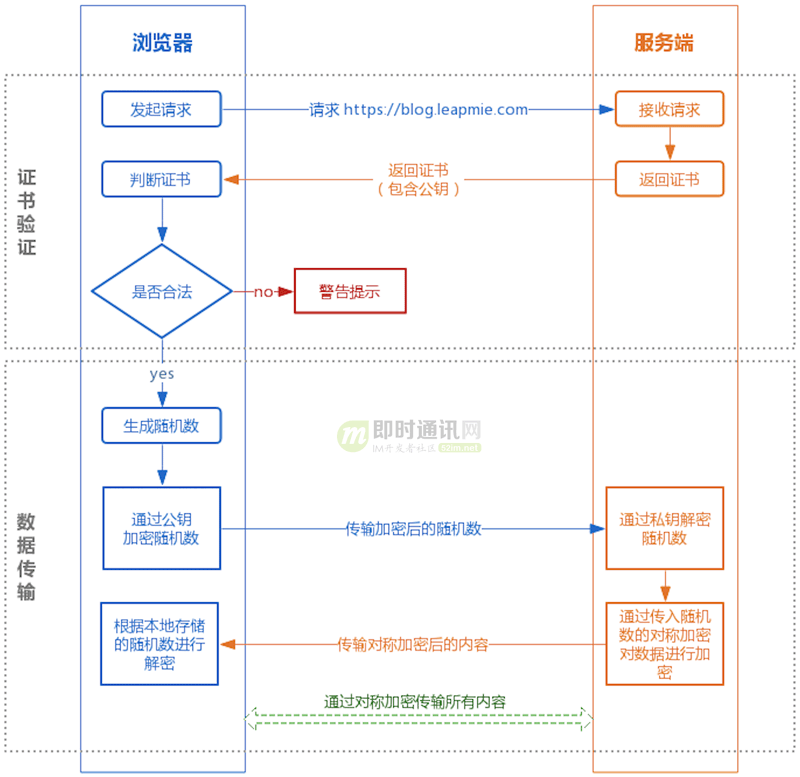

# https

https://www.cnblogs.com/imteck4713/p/12016313.html

HTTPS的整体过程分为证书验证和数据传输阶段：
* 在**证书验证**阶段传递密钥时使用[非对称加密](https://blog.csdn.net/wjiabin/article/details/85228078)。
* 在**数据传输**的加密上使用的是**对称加密**。

>通过查看非对称加密的原理，知道其算法加解密效率非常低，因此只适合用来加解密短小的数据。

具体的交互过程如下： 

上图解析之握手环节：

1. 浏览器：发送自己支持的密钥算法套件（简称Cipher）
2. 服务器：判断自己支持的与其是否有交集，无则断开连接，否则返回：
   >* 证书（包含**对称加密算法**、**hash算法**等）
   >* 非对称加密的公钥
3. 浏览器：
   >* 验证证书的合法性
   >* 生成随机数（对数据传输进行对称加密的密钥）
       * 使用服务器返回的公钥和**非对称加密**算法对随机数进行加密并发送
   >* 握手信息
       * 生成握手信息，使用hash算法对握手信息进行加密，组成“握手信息+加密后的hash值”，最后随机数和**对称加密**算法对其加密后再发送
4. 服务器：
   >* 使用私钥解密得到密钥（随机数），
   >* 再用随机数和对称加密算法对数据解密，取出握手信息后使用hash算法生成hash值，判断结果和浏览器发过来的hash值是否一样
   >* 然后用随机密码加密一段握手消息(握手消息+握手消息的HASH值 )给客户端
5. 浏览器：
   >* 客户端用随机数解密并计算握手消息的HASH，如果与服务端发来的HASH一致，此时握手过程结束，
   
之后所有的通信数据将由之前浏览器生成的随机密码并利用对称加密算法进行加密。

因为这串密钥只有客户端和服务端知道，所以即使中间请求被拦截也是没法解密数据的，以此保证了通信的安全。

**总结：**

1. 非对称加密只用来加解密：对称加密的密钥（随机数）

## 浏览器验证证书的合法性

证书由权威机构发布，包含：
1）颁发机构信息；
2）公钥；
3）公司信息；
4）域名；
5）有效期；
6）指纹；
7）......

浏览器需要对证书做以下验证：

1）验证域名、有效期等信息是否正确：证书上都有包含这些信息，比较容易完成验证；

2）判断证书来源是否合法：每份签发证书都可以根据验证链查找到对应的根证书，操作系统、浏览器会在本地存储权威机构的根证书，利用本地根证书可以对对应机构签发证书完成来源验证

3）判断证书是否被篡改：需要与 CA 服务器进行校验；

4）判断证书是否已吊销：通过CRL（Certificate Revocation List 证书注销列表）和 OCSP（Online Certificate Status Protocol 在线证书状态协议）实现，其中 OCSP 可用于第3步中以减少与 CA 服务器的交互，提高验证效率。

以上任意一步都满足的情况下浏览器才认为证书是合法的。

### 中间人无法冒充服务器

证书是公开的，如果要发起中间人攻击，我在官网上下载一份证书作为我的服务器证书，那客户端肯定会认同这个证书是合法的，如何避免这种**证书冒用**的情况？

虽然中间人可以得到证书，但私钥是无法获取的，一份公钥是不可能推算出其对应的私钥，中间人即使拿到证书也无法伪装成合法服务端，因为无法对客户端传入的加密数据进行解密。

### 防http劫持，却防不了DNS劫持

因为https传输的数据都是加了密的，即使中间有人劫持了访问，也无法对内容进行更改，

但DNS劫持是发生在客户端与服务端建立连接之前，因此，如果有中间人劫持了域名解析，代替客户端与服务端发生连接，这其中就产生了两个https连接，
   * 客户端<->中间人(拥有合法证书)
   * 中间人<->服务端

>因此HTTP 协议被认为不安全是因为传输过程容易被监听者勾线监听、伪造服务器，而 HTTPS 协议主要解决的便是网络传输的安全性问题。

### 可以抓包https

不过要主动安装证书（HTTPS 抓包工具生成的）到本地浏览器。

## SSL会降低网站速度吗？

握手过程结束后，才会开始数据的传输交换，显然这个过程会比HTTP复杂的多，加密又解密，可在实际的使用中，用户的感觉其实相差不大，这主要是因为这个过程的所需耗费的时间不过是几百毫秒（0.1秒=100毫秒），所以用户的体验并没有感觉到网速慢了多少。