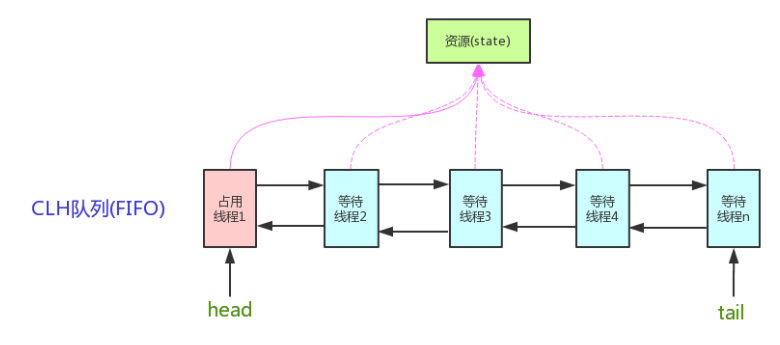

# AQS

**A**bstract**Q**ueued**S**ynchronizer (AQS)：抽象队列同步器。

它是一个抽象类，主要用来构建**锁**，或者说同步器。

```
//java.util.concurrent.locks
public abstract class AbstractQueuedSynchronizer extends AbstractOwnableSynchronizer implements java.io.Serializable {}
```

AQS 提供了一些通用功能的实现，因此，使用 AQS 能**简单且高效**地构造出应用广泛的大量的同步器，比如:
* ReentrantLock，
* Semaphore，
* ReentrantReadWriteLock，
* SynchronousQueue，
* FutureTask(jdk1.7) 

等等皆是基于 AQS 的。

## 原理

核心思想：

* 请求的共享**资源空闲**，
   1. 请求资源的线程设置为有效的**工作线程**，
   2. 将共享资源设置为**锁定状态**。

* 请求的共享**资源被占用**，需要一套**线程阻塞等待**以及被**唤醒时锁分配**的机制，这个机制 AQS 是用 **CLH 队列锁** 实现的，即将暂时获取不到锁的线程加入到队列中。

>CLH(Craig,Landin,and Hagersten)队列是一个虚拟的双向队列（虚拟的双向队列即不存在队列实例，仅存在结点之间的关联关系）。AQS 是将每条请求共享资源的**线程**封装成一个 CLH 锁队列的一个**结点**（Node）来实现锁的分配。

**AQS实现**

* 用一个volatile int 成员变量state来表示争抢的共享资源的同步状态，CAS修改，
* 通过内置的 FIFO(CLH) 队列来完成获取资源线程的排队工作。



## AQS 定义两种资源共享方式

* **独占**：只有一个线程能执行如 
  1. ReentrantLock


* **共享**：多个线程可同时执行，如 
  1. Semaphore、
  2. CountDownLatCh、 
  3. CyclicBarrier、
  4. ReadWriteLock
  
ReentrantReadWriteLock 可以看成是组合式，因为 ReentrantReadWriteLock 也就是读写锁允许多个线程同时对某一资源进行读，不过写时独占。

>独占和共享都可分为：
>1. 公平锁 ：按照线程在队列中的排队顺序，先到者先拿到锁；
>2. 非公平锁 ：当线程要获取锁时，先通过两次 CAS 操作去抢锁，如果没抢到，当前线程再加入到队列中等待唤醒。

## 基于AQS自定义锁

AQS采用模板方法模式，自定义同步器时需要重写下面几个 AQS 提供的模板方法(对于共享资源 state 的获取和释放)：

```
isHeldExclusively()    //该线程是否正在独占资源。只有用到condition才需要去实现它。
tryAcquire(int)        //独占方式。尝试获取资源，成功则返回true，失败则返回false。
tryRelease(int)        //独占方式。尝试释放资源，成功则返回true，失败则返回false。
tryAcquireShared(int)  //共享方式。尝试获取资源。负数表示失败；0表示成功，但没有剩余可用资源；正数表示成功，且有剩余资源。
tryReleaseShared(int)  //共享方式。尝试释放资源，成功则返回true，失败则返回false。
```

一般来说，自定义同步器:
* 要么是独占方法，只需实现tryAcquire-tryRelease、
* 要么是共享方式，只需实现tryAcquireShared-tryReleaseShared.

但 AQS 也支持自定义同步器**同时实现**独占和共享两种方式，如ReentrantReadWriteLock。

## 基于AQS的jdk中的锁

### 独占锁

#### 1. ReentrantLock

ReentrantLock中公平锁和非公平锁实现的区别，
* 在于公平锁只tryAquire一次，并且还要判断队列中是否有先于它的线程存在，
* 而非公平锁要tryAquire两次，并且不判断队列。

>ReentrantLock 默认采用非公平锁（更好的性能），通过 boolean 来决定是否用公平锁（传入 true 用公平锁）。

### 共享锁

#### 1. Semaphore（信号量）

默认非公平模式;

**功能：**

可以指定多个线程同时访问某个资源。

**实现方式：**

它默认构造 AQS 的 state 为 permits。当执行任务的线程数量超出 permits，那么多余的线程将会被放入阻塞队列 Park,并自旋判断 state 是否大于 0。只有当 state 大于 0 的时候，阻塞的线程才能继续执行,此时先前执行任务的线程继续执行 release() 方法，release() 方法使得 state 的变量会加 1，那么自旋的线程便会判断成功。 如此，每次只有最多不超过 permits 数量的线程能自旋成功，便限制了执行任务线程的数量。

Semaphore 对应的两个构造方法如下：

```
public Semaphore(int permits) {
    sync = new NonfairSync(permits);
}

public Semaphore(int permits, boolean fair) {
    sync = fair ? new FairSync(permits) : new NonfairSync(permits);
}
```

**使用示例**：
```
public class SemaphoreExample1 {
  // 请求的数量
  private static final int threadCount = 550;

  public static void main(String[] args) throws InterruptedException {
    // 创建一个具有固定线程数量的线程池对象（如果这里线程池的线程数量给太少的话你会发现执行的很慢）
    ExecutorService threadPool = Executors.newFixedThreadPool(300);
    // 一次只能允许执行的线程数量。
    final Semaphore semaphore = new Semaphore(20);

    for (int i = 0; i < threadCount; i++) {
      final int threadnum = i;
      threadPool.execute(() -> {// Lambda 表达式的运用
        try {
          semaphore.acquire();// 获取一个许可，所以可运行线程数量为20/1=20
          test(threadnum);
          semaphore.release();// 释放一个许可
        } catch (InterruptedException e) {
          // TODO Auto-generated catch block
          e.printStackTrace();
        }

      });
    }
    threadPool.shutdown();
    System.out.println("finish");
  }

  public static void test(int threadnum) throws InterruptedException {
    Thread.sleep(1000);// 模拟请求的耗时操作
    System.out.println("threadnum:" + threadnum);
    Thread.sleep(1000);// 模拟请求的耗时操作
  }
}
```

#### 2. CountDownLatch （倒计时器）

**功能**

允许 count 个线程阻塞在一个地方，直至所有线程的任务都执行完毕。

**实现方式**

它默认构造 AQS 的 state 值为 count。当线程使用 `countDown()` 方法时,其实使用了tryReleaseShared方法以 CAS 的操作来减少 state,直至 state 为 0 。当调用 `await()` 方法的时候，如果 state 不为 0，那就证明任务还没有执行完毕，`await()` 方法就会一直阻塞，也就是说 `await()` 方法之后的语句不会被执行。然后，CountDownLatch 会自旋 CAS 判断 state == 0，如果 state == 0 的话，就会释放所有等待的线程，`await()` 方法之后的语句得到执行。

**使用示例**

```
public class CountDownLatchExample1 {
  // 请求的数量
  private static final int threadCount = 550;

  public static void main(String[] args) throws InterruptedException {
    // 创建一个具有固定线程数量的线程池对象（如果这里线程池的线程数量给太少的话你会发现执行的很慢）
    ExecutorService threadPool = Executors.newFixedThreadPool(300);
    final CountDownLatch countDownLatch = new CountDownLatch(threadCount);
    for (int i = 0; i < threadCount; i++) {
      final int threadnum = i;
      threadPool.execute(() -> {// Lambda 表达式的运用
        try {
          test(threadnum);
        } catch (InterruptedException e) {
          // TODO Auto-generated catch block
          e.printStackTrace();
        } finally {
          countDownLatch.countDown();// 表示一个请求已经被完成
        }

      });
    }
    countDownLatch.await();
    threadPool.shutdown();
    System.out.println("finish");
  }

  public static void test(int threadnum) throws InterruptedException {
    Thread.sleep(1000);// 模拟请求的耗时操作
    System.out.println("threadnum:" + threadnum);
    Thread.sleep(1000);// 模拟请求的耗时操作
  }
}
```

**两种典型用法**

1、某一线程在开始运行前等待 n 个线程执行完毕。

>将 CountDownLatch 的计数器初始化为 n （`new CountDownLatch(n)`），每当一个任务线程执行完毕，就将计数器减 1 （`countdownlatch.countDown()`），当计数器的值变为 0 时，在 CountDownLatch 上 `await()` 的线程就会被唤醒。一个典型应用场景就是启动一个服务时，主线程需要等待多个组件加载完毕，之后再继续执行。

2、实现多个线程开始执行任务的最大并行性。

>注意是并行性，不是并发，强调的是多个线程在某一时刻同时开始执行。类似于赛跑，将多个线程放到起点，等待发令枪响，然后同时开跑。做法是初始化一个共享的 CountDownLatch 对象，将其计数器初始化为 1 （`new CountDownLatch(1)`），多个线程在开始执行任务前首先 `coundownlatch.await()`，当主线程调用 `countDown()` 时，计数器变为 0，多个线程同时被唤醒。

#### 3. CyclicBarrier(循环栅栏)

**功能**

CyclicBarrier 和 CountDownLatch 类似，它也可以实现线程间的技术等待，但是功能更加复杂和强大。

**实现方法**

CyclicBarrier 的字面意思是可循环使用（Cyclic）的屏障（Barrier）。它要做的事情是：让一组线程到达一个屏障（也可以叫同步点）时被阻塞，直到最后一个线程到达屏障时，屏障才会开门，所有被屏障拦截的线程才会继续干活。

CyclicBarrier 默认的构造方法是 CyclicBarrier(int parties)，其参数表示**屏障拦截的线程数量**，每个线程调用 await() 方法告诉 CyclicBarrier 我已经到达了屏障，然后当前线程被阻塞。

```
public CyclicBarrier(int parties) {
    this(parties, null);
}

public CyclicBarrier(int parties, Runnable barrierAction) {
    if (parties <= 0) throw new IllegalArgumentException();
    this.parties = parties;
    this.count = parties;
    this.barrierCommand = barrierAction;
}
```

`parties` 就代表了有拦截的线程的数量，当拦截的线程数量达到这个值的时候就打开栅栏，让所有线程通过。

>CountDownLatch 的实现是基于 AQS 的，而 CycliBarrier 是基于 ReentrantLock 和 Condition 的。

**应用场景**

可以用于多线程计算数据，最后合并计算结果的应用场景。比如我们用一个 Excel 保存了用户所有银行流水，每个 Sheet 保存一个帐户近一年的每笔银行流水，现在需要统计用户的日均银行流水，先用多线程处理每个 sheet 里的银行流水，都执行完之后，得到每个 sheet 的日均银行流水，最后，再用 barrierAction 用这些线程的计算结果，计算出整个 Excel 的日均银行流水。

**使用示例**

```
public class CyclicBarrierExample2 {
  // 请求的数量
  private static final int threadCount = 550;
  // 需要同步的线程数量
  private static final CyclicBarrier cyclicBarrier = new CyclicBarrier(5);

  public static void main(String[] args) throws InterruptedException {
    // 创建线程池
    ExecutorService threadPool = Executors.newFixedThreadPool(10);

    for (int i = 0; i < threadCount; i++) {
      final int threadNum = i;
      Thread.sleep(1000);
      threadPool.execute(() -> {
        try {
          test(threadNum);
        } catch (InterruptedException e) {
          // TODO Auto-generated catch block
          e.printStackTrace();
        } catch (BrokenBarrierException e) {
          // TODO Auto-generated catch block
          e.printStackTrace();
        }
      });
    }
    threadPool.shutdown();
  }

  public static void test(int threadnum) throws InterruptedException, BrokenBarrierException {
    System.out.println("threadnum:" + threadnum + "is ready");
    try {
      /**等待60秒，保证子线程完全执行结束*/
      cyclicBarrier.await(60, TimeUnit.SECONDS);
    } catch (Exception e) {
      System.out.println("-----CyclicBarrierException------");
    }
    System.out.println("threadnum:" + threadnum + "is finish");
  }
}
```

1. CountDownLatch 可以让某一个线程等待直到倒计时结束，再开始执行；也可以一个子线程执行结束后，然后countdown(),主线程调用await阻塞等待所有子线程执行完毕，再往下执行。
2. CyclicBarrier 让一组线程到达一个屏障（也可以叫同步点）时被阻塞，直到最后一个线程到达屏障时，屏障才会开门，所有被屏障拦截的线程才会继续干活

上面两个共享锁使用场景一样。
