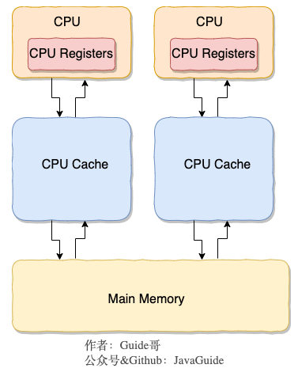

# CPU 缓存模型

CPU 缓存则是为了解决 CPU 处理速度和内存处理速度不对等的问题。
>类比开发网站后台系统使用的缓存（比如 Redis）是为了解决程序处理速度和访问常规关系型数据库速度不对等的问题。 
>
>同理，可以把 内存可以看作外存的高速缓存，程序运行时候把外存的数据复制到内存，由于内存的处理速度远远高于外存，这样提高了处理速度。

CPU Cache 示意图如下（实际上，现代的 CPU Cache 通常分为三层，分别叫 L1,L2,L3 Cache）:

**CPU Cache 的工作方式：**

先复制一份数据到 CPU Cache 中，当 CPU 需要用到的时候就可以直接从 CPU Cache 中读取数据，当运算完成后，再将运算得到的数据写回 Main Memory 中。但是，这样存在 内存缓存不一致性的问题 ！比如我执行一个 i++操作的话，如果两个线程同时执行的话，假设两个线程从 CPU Cache 中读取的 i=1，两个线程做了 1++运算完之后再写回 Main Memory 之后 i=2，而正确结果应该是 i=3。

CPU 为了解决内存缓存不一致性问题可以通过制定**缓存一致协议**([MESI协议](../../chapter16/section1/index.md)）或者其他手段来解决。