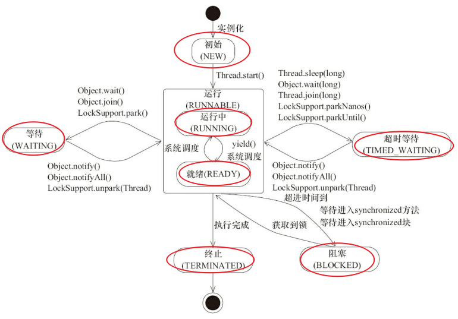

# 生命周期（各个状态）


wait叫等待，抢不到锁才叫阻塞。

【操作系统中层面线程有 READY 和 RUNNING 状态，但jvm因为这两种状态切换时间太短，直接合二为一称之为**RUNNABLE**状态】

通过 sleep（long millis）方法或 wait（long millis）方法可以将 Java 线程置于 **TIMED_WAITING** 状态。当超时时间到达后 Java 线程将会返回到 RUNNABLE （其实是就绪）状态。

## Object.wait|Object.notify实例

**Object的实例方法**(不过只调用锁对象中的该方法)

```
public class Main {
    Object odd = new Object(); // 奇数条件锁
    Object even = new Object(); // 偶数条件锁
    private int max=200;
    private AtomicInteger status = new AtomicInteger(0); // AtomicInteger保证可见性，也可以用volatile

    public static void main(String[] args) {
        Main main = new Main();
        Thread printer1 = new Thread(main.new MyPrinter("线程1", 0));
        Thread printer2 = new Thread(main.new MyPrinter("线程2", 1));
        printer1.start();
        printer2.start();
    }
    public class MyPrinter implements Runnable {
        private String name;
        private int type; // 打印的类型，0：代表打印奇数，1：代表打印偶数

        public MyPrinter(String name, int type) {
            this.name = name;
            this.type = type;
        }

        @Override
        public void run() {
            if (type == 0){
                while(status.get()<20){
                    if(status.get()%2==0){
                        synchronized (even){
                            try {
                                even.wait();
                            } catch (InterruptedException e) {
                                e.printStackTrace();
                            }
                        }
                    }else{
                        synchronized (odd){
                            System.out.println("当前是"+name+"输出"+status.get());
                            status.set(status.get()+1);
                            odd.notify();
                        }
                    }
                }
            }else{
                while(status.get()<20){
                    if(status.get()%2==1){
                        synchronized (odd){
                            try {
                                odd.wait();
                            } catch (InterruptedException e) {
                                e.printStackTrace();
                            }
                        }
                    }else{
                        synchronized (even){
                            System.out.println("当前是"+name+"输出"+status.get());
                            status.set(status.get()+1);
                            even.notify();
                        }
                    }
                }
            }
        }
    }
}
```

## Thread.sleep|Thread.yield

**两者是Thread类的静态方法。**

* sleep交出的资源所有线程都可以去竞争，
* yield交出的时间片资源只有和当前线程同优先级的线程才可以获取到。

如果持有锁的话，两者都不释放锁。
>Java中，通过一个整型变量Priority来控制线程的优先级，范围为1~10,通过调用setPriority（int Priority）可以设置，默认值为5。

## join

**join是Thread类的实例方法。**

A线程如果调用了B线程的join方法，那么A线程会一直阻塞直到B线程运行结束。

```
class AThread extends Thread {
    BThread bt;
    public AThread(BThread bt) {
        super("[AThread] Thread");
        this.bt = bt;
    }
    public void run() {
        String threadName = Thread.currentThread().getName();
        System.out.println(threadName + " start.");
        try {
            bt.join();//调用之后，A线程阻塞直到B线程运行结束
            System.out.println(threadName + " end.");
        } catch (Exception e) {
            System.out.println("Exception from " + threadName + ".run");
        }
    }
}
```

## interrupt

**interrupt是Thread类的实例方法。**

interrupt基于一个线程不应该由其他线程来强制中断或停止，而是应该由线程内部来自行停止的思想来实现的，自己的事自己处理，是一种比较温柔和安全的做法，而且中断不活动的线程不会产生任何影响。


调用interrupt()会立即将线程的中断标记设为“true”，因此代码可以这样写：

```
public class InterruptionInJava implements Runnable{
 
    public static void main(String[] args) throws InterruptedException {
        Thread testThread = new Thread(new InterruptionInJava(),"InterruptionInJava");
        //start thread
        testThread.start();
        Thread.sleep(1000);//主线程sleep
        
        //interrupt thread
        testThread.interrupt();
 
        System.out.println("main end");
    }
 
    @Override
    public void run() {
        while (!Thread.currentThread().isInterrupted()) {
        }
    }
}
```

但是由于线程处于"阻塞"状态（包含了I/O阻塞或线程等待状态或抢不到锁进入的阻塞状态），所以该“中断标记”会立即被清除为“false”，同时，会产生一个InterruptedException的异常。此时应这样写：
```
@Override
public void run() {
    try {
        // 1. isInterrupted()保证，只要中断标记为true就终止线程。
        while (!Thread.currentThread().isInterrupted()) {
            Thread.sleep(10000000);
        }
    } catch (InterruptedException ie) {  
        // 2. InterruptedException异常保证，当InterruptedException异常产生时，线程被终止。
    }
}
```
中断时抛出的异常种类有：
>除非当前线程正在中断自身（始终允许），否则将调用此线程的checkAccess方法，但这可能导致抛出SecurityException。
>
>如果在调用Object类的wait（）、join（）、sleep（long）阻塞了这个线程，那么它的中断状态将被清除并收到InterruptedException。
>
>如果在InterruptibleChannel上的I / O操作中阻塞了该线程，则该通道将被关闭，线程的中断状态将被设置，并且线程将收到ClosedByInterruptException。

获得中断标记的区别：
>* interrupted()除了返回中断标记之外，它还会清除中断标记(即将中断标记设为false)；
>* 而isInterrupted()仅仅返回中断标记。