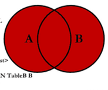

# 7种join详解


## Join算法原理

MySQL的join算法原理基于嵌套循环查询。但是由于简单的嵌套循环查询存在效率低下，频繁与磁盘进行I/O的问题，故MySQL会分别从减少内层循环次数，以及减少I/O次数两个层面对join的简单嵌套循环查询进行优化。

从本质上来说，MySQL的join算法基于简单嵌套循环查询，即外层表的记录作为条件，循环遍历内层表进行查询，返回内层循环中满足条件的记录。对于SQL语句: 
```
select * from a left join b on a.id=b.id。
```
```
for(a from 外层表){  
    for(b from 内层表){  
        if(a.id == b.id){  
            return;  
        }  
    }  
}  
```
但是简单的嵌套循环查询效率比较低，本质上是:
1. 因为每次查询时都是从外层表取出一次记录，即进行一个I/O，
2. 并且对内层表的查询是全表扫描，
故可以从这两个角度对简单嵌套循环查询进行优化。

优化1: 从优化I/O的角度，**每次I/O**取外层表的**多条记录**进行缓存，多条记录同时在内层循环中进行查找。

优化2: 内层循环的查询可以通过**建立索引**进行优化，通过索引进行查找的次数只为索引B树的高度。这就是索引嵌套循环连接。对于上述的SQL语句:`select * from a left join b on a.id=b.id`，如果在b表对id字段建立了索引，则外层的循环查询在内层循环中会使用到索引，从而减少了查询的次数。

## 最后两个图的mysql实现

```
select * from a left join b on a.id=b.id  
union  
select * from a right join b on a.id=b.id;  
```

```
select * from a left join b on a.id=b.id where b.id is null  
union  
select * from a right join b on a.id=b.id where a.id is null;  
```