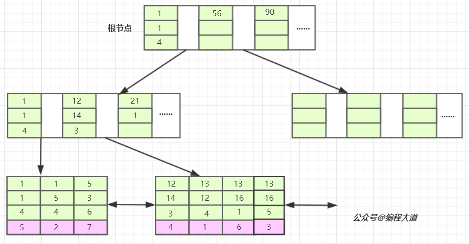

# 索引

https://www.bilibili.com/video/BV1KW411u7vy
https://blog.csdn.net/feichitianxia/article/details/107997795

结合视频和博客，对mysql的索引和锁有了具体的了解。

总的来说，对sql性能的优化，就是要建立正确的索引，

无论是查询涉及到的where, 排序用的order by，或者是先排序后分组的group by，对高并发支持的innodb引擎的行锁，都要依赖于索引。

行锁锁的对象就是索引，所以如果更新条件where没用到索引，那么行锁就会**升级**成表锁，降低并发性能。

## 1 联合索引图

## 1.1 索引最左前缀原则

常见联合索引
索引index1:(a,b,c)，只会走a、a,b、a,b,c 三种类型的查询，其实这里说的有一点问题，a,c也走，但是只走a字段索引，不会走c字段。

另外还有一个特殊情况说明下，select * from table where a = '1' and b > ‘2’ and c='3' 这种类型的也只会有a与b走索引，c不会走。

原因如下：

索引是有序的，index1索引在索引文件中的排列是有序的，首先根据a来排序，然后才是根据b来排序，最后是根据c来排序，

像select * from table where a = '1' and b > ‘2’ and c='3' 这种类型的sql语句，在a、b走完索引后，c肯定是无序了，所以c就没法走索引，数据库会觉得还不如全表扫描c字段来的快。（感觉这一块说的始终有点牵强，无序又怎样，从剩下的里面挨着挨着找不就好了吗？）

## 2 聚簇索引和非聚簇索引

[聚簇索引是什么](https://blog.csdn.net/xixibuchi/article/details/123673414)

### 2.1 聚簇索引

就是按照每张表的**主键**构造一颗B+树，同时**叶子节点**中存放的就是整张表的**行记录数据**，

>也将聚集索引的叶子节点称为数据页。

这个特性决定了索引组织表中**数据也是索引的一部分**，每张表只能拥有一个聚簇索引。

**怎样选择聚簇索引**

Innodb通过主键聚集数据，如果没有定义主键，innodb会选择非空的唯一索引代替。如果没有这样的索引，innodb会隐式的定义一个主键来作为聚簇索引。

**聚簇索引的优缺点**

优点：

数据访问更快，因为聚簇索引将索引和数据保存在同一个B+树中，因此从聚簇索引中获取数据比非聚簇索引更快

>聚簇索引对于主键的排序查找和范围查找速度非常快

缺点：

插入速度严重依赖于插入顺序，按照主键的顺序插入是最快的方式，否则将会出现页分裂，严重影响性能。因此，对于InnoDB表，我们一般都会定义一个自增的ID列为主键

>更新主键的代价很高，因为将会导致被更新的行移动。因此，对于InnoDB表，我们一般定义主键为不可更新。

### 2.2 非聚簇索引

又叫辅助索引或二级索引。

在聚簇索引之上创建的索引称之为辅助索引，辅助索引叶子节点存储的不再是行的物理位置，而是主键值。

>Innodb辅助索引的叶子节点并不包含行记录的全部数据，叶子节点除了包含键值外，还包含了相应行数据的聚簇索引键。

因此辅助索引访问数据总是需要二次查找。

**查找数据方式**

通过辅助索引首先找到的是主键值，再通过主键值找到数据行的数据页，再通过数据页中的Page Directory找到数据行。

**总结**

辅助索引的存在不影响数据在聚簇索引中的组织，所以一张表可以有多个辅助索引。