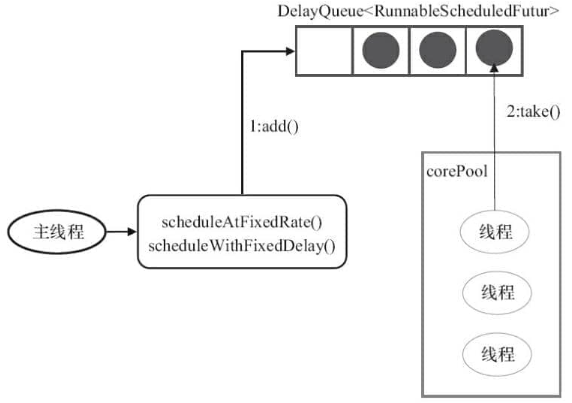
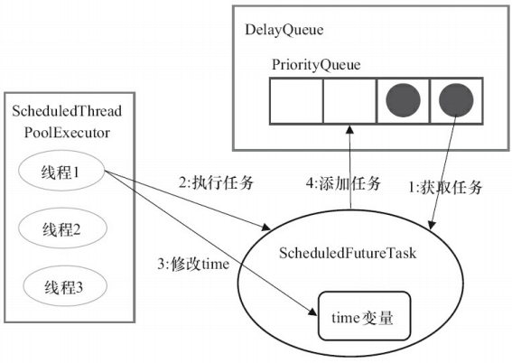

# 线程池

线程池参数解析：

1. 最小线程数量
2. 最大线程数量
3. 任务队列（包括长度）
4. 空闲线程可存活时间（大于最小线程数量的其它线程）
5. 饱和策略（线程数量和任务队列都满了该怎么做）

submit()，线程池会返回一个 Future 类型的对象，Future 的get()方法会阻塞当前调用线程直到任务完成。

## 1 线程池大小确定

有一个简单并且适用面比较广的公式，N（CPU 核心数）：

* CPU 密集型任务(N+1)： 这种任务消耗的主要是 CPU 资源，可以将线程数设置为 N+1，比 CPU 核心数多出来的一个线程是为了防止线程偶发的缺页中断，或者其它原因导致的任务暂停而带来的影响。一旦任务暂停，CPU 就会处于空闲状态，而在这种情况下多出来的一个线程就可以充分利用 CPU 的空闲时间。
* I/O 密集型任务(2N)： 这种任务应用起来，系统会用大部分的时间来处理 I/O 交互，而线程在处理 I/O 的时间段内不会占用 CPU 来处理，这时就可以将 CPU 交出给其它线程使用。因此在 I/O 密集型任务的应用中，我们可以多配置一些线程，具体的计算方法是 2N。

如何判断是 CPU 密集任务还是 IO 密集任务？

* CPU 密集型：简单理解就是利用 CPU 计算能力的任务比如你在内存中对大量数据进行排序。
* IO 密集型：但凡涉及到网络读取，文件读取这类都是，这类任务的特点是 CPU 计算耗费时间相比于等待 IO 操作完成的时间来说很少，大部分时间都花在了等待 IO 操作完成上。

## 2 常见线程池

https://snailclimb.gitee.io/javaguide/#/./docs/java/concurrent/java-thread-pool-summary?id=_52-singlethreadexecutor-%e8%af%a6%e8%a7%a3

### 2.1 FixedThreadPool

`FixedThreadPool` 被称为可重用固定线程数的线程池。

```
/**
* 创建一个可重用固定数量线程的线程池
*/
public static ExecutorService newFixedThreadPool(int nThreads, ThreadFactory threadFactory) {
    return new ThreadPoolExecutor(nThreads, nThreads,
                                    0L, TimeUnit.MILLISECONDS,
                                    new LinkedBlockingQueue<Runnable>(),
                                    threadFactory);
}

public static ExecutorService newFixedThreadPool(int nThreads) {
    return new ThreadPoolExecutor(nThreads, nThreads,
                                    0L, TimeUnit.MILLISECONDS,
                                    new LinkedBlockingQueue<Runnable>());
}
```

`FixedThreadPool` 的 `corePoolSize` 和 `maximumPoolSize` 都被设置为 nThreads，这个 nThreads 参数是我们使用的时候自己传递的。

**运行过程：**

1. 如果当前运行的线程数小于 `corePoolSize`， 如果再来新任务的话，就创建新的线程来执行任务；
2. 当前运行的线程数等于 `corePoolSize` 后， 如果再来新任务的话，会将任务加入 `LinkedBlockingQueue`；
3. 线程池中的线程执行完 手头的任务后，会在循环中反复从 `LinkedBlockingQueue` 中获取任务来执行；

#### 2.1.1 不推荐使用FixedThreadPool

`FixedThreadPool` 使用无界队列 `LinkedBlockingQueue`（队列的容量为 `Integer.MAX_VALUE`）作为线程池的工作队列会对线程池带来如下影响 ：

1. 当线程池中的线程数达到 corePoolSize 后，新任务将在无界队列中等待，因此线程池中的线程数不会超过 corePoolSize；
2. 由于使用无界队列时 maximumPoolSize 将是一个无效参数，因为不可能存在任务队列满的情况。所以，通过创建 FixedThreadPool的源码可以看出创建的 FixedThreadPool 的 corePoolSize 和 maximumPoolSize 被设置为同一个值。
3. 由于 1 和 2，使用无界队列时 keepAliveTime 将是一个无效参数；
4. 运行中的 FixedThreadPool（未执行 shutdown()或 shutdownNow()）不会拒绝任务，在任务比较多的时候会导致 OOM（内存溢出）。

### 2.2 SingleThreadExecutor

`SingleThreadExecutor` 是只有一个线程的线程池。

```
/**
*返回只有一个线程的线程池
*/
public static ExecutorService newSingleThreadExecutor(ThreadFactory threadFactory) {
    return new FinalizableDelegatedExecutorService
        (new ThreadPoolExecutor(1, 1,
                                0L, TimeUnit.MILLISECONDS,
                                new LinkedBlockingQueue<Runnable>(),
                                threadFactory));
}
public static ExecutorService newSingleThreadExecutor() {
    return new FinalizableDelegatedExecutorService
        (new ThreadPoolExecutor(1, 1,
                                0L, TimeUnit.MILLISECONDS,
                                new LinkedBlockingQueue<Runnable>()));
}
```

新创建的 `SingleThreadExecutor` 的 `corePoolSize` 和 `maximumPoolSize` 都被设置为 **1**.其他参数和 `FixedThreadPool` 相同。

**运行过程：**

1. 如果当前运行的线程数少于 `corePoolSize`，则创建一个新的线程执行任务；
2. 当前线程池中有一个运行的线程后，将任务加入 `LinkedBlockingQueue`;
3. 线程执行完当前的任务后，会在循环中反复从`LinkedBlockingQueue` 中获取任务来执行；

#### 2.2.1 不推荐使用SingleThreadExecutor

SingleThreadExecutor 使用无界队列 LinkedBlockingQueue 作为线程池的工作队列（队列的容量为 Intger.MAX_VALUE）。

SingleThreadExecutor 使用无界队列作为线程池的工作队列会对线程池带来的影响与 FixedThreadPool 相同。说简单点就是可能会导致 OOM，

### 2.3 CachedThreadPool

CachedThreadPool 是一个会根据需要创建新线程的线程池。

```
/**
* 创建一个线程池，根据需要创建新线程，但会在先前构建的线程可用时重用它。
*/
public static ExecutorService newCachedThreadPool(ThreadFactory threadFactory) {
    return new ThreadPoolExecutor(0, Integer.MAX_VALUE,
                                    60L, TimeUnit.SECONDS,
                                    new SynchronousQueue<Runnable>(),
                                    threadFactory);
}
public static ExecutorService newCachedThreadPool() {
    return new ThreadPoolExecutor(0, Integer.MAX_VALUE,
                                    60L, TimeUnit.SECONDS,
                                    new SynchronousQueue<Runnable>());
}
```

`CachedThreadPool` `的corePoolSize` 被设置为空（0），`maximumPoolSize`被设置为 `Integer.MAX.VALUE`，即它是无界的，这也就意味着如果主线程提交任务的速度高于 `maximumPool` 中线程处理任务的速度时，`CachedThreadPool` 会不断创建新的线程。极端情况下，这样会导致耗尽 cpu 和内存资源。

**运行过程：**

1. 首先执行 `SynchronousQueue.offer(Runnable task)` 提交任务到任务队列。如果当前 `maximumPool` 中有闲线程正在执行 `SynchronousQueue.poll(keepAliveTime,TimeUnit.NANOSECONDS)`，那么主线程执行 `offer` 操作与空闲线程执行的 `poll` 操作配对成功，主线程把任务交给空闲线程执行，`execute()`方法执行完成，否则执行下面的步骤 2；
2. 当初始 `maximumPool` 为空，或者 `maximumPool` 中没有空闲线程时，将没有线程执行 `SynchronousQueue.poll(keepAliveTime,TimeUnit.NANOSECONDS)`。这种情况下，步骤 1 将失败，此时 `CachedThreadPool` 会创建新线程执行任务，`execute` 方法执行完成；

#### 2.3.1 不推荐使用CachedThreadPool

`CachedThreadPool`允许创建的线程数量为 `Integer.MAX_VALUE` ，可能会创建大量线程，从而导致 `OOM`。

### 2.4 ScheduledThreadPoolExecutor

`ScheduledThreadPoolExecutor` 主要用来在**给定的延迟后**运行任务，或者**定期**执行任务。 

>这个在实际项目中基本不会被用到，也不推荐使用，简单了解一下思想即可。

#### 2.4.1 运行机制

`ScheduledThreadPoolExecutor` 使用的任务队列 `DelayQueue` 封装了一个 `PriorityQueue`，PriorityQueue 会对队列中的任务进行排序：

1. 执行所需**时间短的放在前面**先被执行(`ScheduledFutureTask` 的 `time` 变量小的先执行)，
2. 如果执行所需时间相同则**先提交的任务**将被先执行(`ScheduledFutureTask` 的 `squenceNumber` 变量小的先执行)。



`ScheduledThreadPoolExecutor` 的执行主要分为2大部分：

1. 当调用 `ScheduledThreadPoolExecutor` 的 `scheduleAtFixedRate()` 方法或者 `scheduleWithFixedDelay()` 方法时，会向 `ScheduledThreadPoolExecutor` 的 `DelayQueue` 添加一个实现了 `RunnableScheduledFuture` 接口的 `ScheduledFutureTask` 。
2. 线程池中的线程从 `DelayQueue` 中获取 `ScheduledFutureTask`，然后执行任务。

#### 2.4.2 执行周期任务的步骤

`ScheduledThreadPoolExecutor` 为了实现周期性的执行任务，对 `ThreadPoolExecutor`做了如下修改：

* 使用 `DelayQueue` 作为任务队列；
* 获取任务的方不同；
* 执行周期任务后，增加了额外的处理。



1. 线程 1 从 `DelayQueue` 中获取已到期的 `ScheduledFutureTask(DelayQueue.take())`。到期任务是指 `ScheduledFutureTask`的 `time` 大于等于当前系统的时间；
2. 线程 1 执行这个 `ScheduledFutureTask`；
3. 线程 1 修改 `ScheduledFutureTask` 的 `time` 变量为下次将要被执行的时间；
4. 线程 1 把这个修改 time 之后的 `ScheduledFutureTask` 放回 `DelayQueue` 中（`DelayQueue.add()`）。

#### 2.4.3 ScheduledThreadPoolExecutor 和 Timer 的比较

-|Timer|ScheduledThreadPoolExecutor
:-|:-|:-
对系统时钟的变化|敏感|不敏感
线程数量|只有一个执行线程，因此长时间运行的任务可以延迟其他任务|可以配置任意数量的线程。 此外，如果你想（通过提供 ThreadFactory），你可以完全控制创建的线程;
运行时异常|在TimerTask 中抛出的运行时异常会杀死一个线程，从而导致 Timer 死机:-( ...即计划任务将不再运行。|不仅捕获运行时异常，还允许您在需要时处理它们（通过重写 afterExecute 方法ThreadPoolExecutor）。抛出异常的任务将被取消，但其他任务将继续运行。

综上，在 JDK1.5 之后，你没有理由再使用 Timer 进行任务调度了。

## 3 Excutor使用

1. 主线程首先要创建实现 `Runnable` 或者 `Callable` 接口的任务对象。
2. 把创建完成的实现 `Runnable`/`Callable`接口的 对象直接交给 `ExecutorService` 执行: `ExecutorService.execute(Runnable command)`或者也可以把 `Runnable` `对象或Callable` 对象提交给 `ExecutorService` 执行（`ExecutorService.submit(Runnable task)`或 `ExecutorService.submit(Callable <T> task)`）。
3. 如果执行 `ExecutorService.submit(…)`，`ExecutorService` 将返回一个实现`Future`接口的对象（我们刚刚也提到过了执行 `execute()`方法和 `submit()`方法的区别，`submit()`会返回一个 `FutureTask` 对象）。由于 `FutureTask` 实现了 `Runnable`，我们也可以创建 `FutureTask`，然后直接交给 `ExecutorService` 执行。
    3.1 最后，主线程可以执行 `FutureTask.get()`方法来等待任务执行完成。主线程也可以执行 `FutureTask.cancel(boolean mayInterruptIfRunning)`来取消此任务的执行。